## 1. Skill Overview and Principles

Esta skill orienta o desenvolvimento e a refatoração de código seguindo as melhores práticas de engenharia de software. O design orientado a objetos e a arquitetura de software de alta qualidade baseiam-se em princípios fundamentais que evitam a rigidez, a fragilidade e o acoplamento excessivo do código.

### Princípios de Design de Software

#### SOLID
Os cinco princípios SOLID formam a base para o design orientado a objetos manutenível:
1. **S - Single Responsibility Principle (Princípio da Responsabilidade Única):** Uma classe ou módulo deve ter um, e apenas um, motivo para mudar. Isso promove alta coesão e facilidade de teste.
2. **O - Open/Closed Principle (Princípio do Aberto/Fechado):** Entidades de software devem estar abertas para extensão, mas fechadas para modificação. Devemos ser capazes de introduzir novos comportamentos sem alterar o código existente, normalmente através de abstrações e polimorfismo.
3. **L - Liskov Substitution Principle (Princípio da Substituição de Liskov):** Objetos de uma superclasse devem ser substituíveis por objetos de suas subclasses sem quebrar o comportamento correto da aplicação. A herança deve representar uma relação comportamental válida, não apenas compartilhamento de código.
4. **I - Interface Segregation Principle (Princípio da Segregação de Interfaces):** Clientes não devem ser forçados a depender de interfaces que não utilizam. É melhor ter várias interfaces específicas do que uma interface única e genérica ("gorda").
5. **D - Dependency Inversion Principle (Princípio da Inversão de Dependência):** Módulos de alto nível não devem depender de módulos de baixo nível. Ambos devem depender de abstrações. Além disso, abstrações não devem depender de detalhes; detalhes devem depender de abstrações.

#### Outros Princípios Fundamentais
*   **DRY (Don't Repeat Yourself):** Cada pedaço de conhecimento ou lógica de negócio deve ter uma representação única, inequívoca e autoritativa dentro do sistema. Evita problemas de sincronização de alterações e duplicação desnecessária.
*   **KISS (Keep It Simple, Stupid):** A simplicidade deve ser um objetivo fundamental do design. Soluções simples são mais fáceis de entender, manter e evoluir do que soluções excessivamente complexas ou superengenheiradas.
*   **YAGNI (You Aren't Gonna Need It):** Não implemente funcionalidades ou flexibilidades extras antes que elas sejam realmente necessárias. Adicione flexibilidade apenas quando houver um requisito real que a justifique, evitando o desperdício de tempo e o aumento da complexidade acidental.

---

### Padrões de Projeto Clássicos da GoF (Gang of Four)

Os padrões GoF dividem-se em três categorias principais, cada uma focando em um aspecto do design de software:

```mermaid
graph TD
    GoF[Padrões de Projeto GoF] --> Criacionais[Criacionais]
    GoF --> Estruturais[Estruturais]
    GoF --> Comportamentais[Comportamentais]

    Criacionais --> FactoryMethod[Factory Method]
    Criacionais --> AbstractFactory[Abstract Factory]
    Criacionais --> Builder[Builder]
    Criacionais --> Prototype[Prototype]
    Criacionais --> Singleton[Singleton]

    Estruturais --> Adapter[Adapter]
    Estruturais --> Bridge[Bridge]
    Estruturais --> Composite[Composite]
    Estruturais --> Decorator[Decorator]
    Estruturais --> Facade[Facade]
    Estruturais --> Flyweight[Flyweight]
    Estruturais --> Proxy[Proxy]

    Comportamentais --> ChainOfResp[Chain of Responsibility]
    Comportamentais --> Command[Command]
    Comportamentais --> Interpreter[Interpreter]
    Comportamentais --> Iterator[Iterator]
    Comportamentais --> Mediator[Mediator]
    Comportamentais --> Memento[Memento]
    Comportamentais --> Observer[Observer]
    Comportamentais --> State[State]
    Comportamentais --> Strategy[Strategy]
    Comportamentais --> TemplateMethod[Template Method]
    Comportamentais --> Visitor[Visitor]
```



#### 1. Padrões Criacionais
Focam no processo de criação de objetos, abstraindo a instanciação e tornando o sistema independente de como seus objetos são criados, compostos e representados.

| Padrão | Quando Usar | Benefício Principal |
| :--- | :--- | :--- |
| **Factory Method** | Quando uma classe não pode antecipar a classe de objetos que precisa criar, ou quer delegar essa criação para subclasses. | Desacopla a criação do objeto do seu uso. |
| **Abstract Factory** | Quando o sistema precisa ser independente de como seus produtos são criados e lida com famílias de objetos relacionados. | Garante a consistência entre produtos da mesma família. |
| **Builder** | Quando o processo de construção de um objeto complexo deve permitir diferentes representações e etapas de configuração. | Permite criação passo a passo; evita construtores com muitos parâmetros. |
| **Prototype** | Quando o custo de criar um novo objeto do zero é alto ou quando se deseja clonar objetos existentes dinamicamente. | Evita a subclassificação de criadores; copia instâncias configuradas. |
| **Singleton** | Quando deve haver exatamente uma instância de uma classe acessível globalmente (ex: gerenciador de conexão com o banco). | Ponto único de acesso controlado. (Atenção: pode dificultar testes unitários). |

#### 2. Padrões Estruturais
Lidam com a composição de classes ou objetos para formar estruturas maiores e mais complexas, garantindo que as partes sejam eficientes e flexíveis.

| Padrão | Quando Usar | Benefício Principal |
| :--- | :--- | :--- |
| **Adapter** | Quando você precisa usar uma classe existente, mas a interface dela não corresponde à interface que o cliente espera. | Permite a colaboração de classes com interfaces incompatíveis. |
| **Bridge** | Quando você deseja evitar um vínculo permanente entre uma abstração e sua implementação (ex: múltiplas plataformas de UI). | Separa a interface da implementação, permitindo variação independente. |
| **Composite** | Quando você precisa representar hierarquias do tipo parte-todo e quer que clientes tratem objetos individuais e composições uniformemente. | Simplifica o cliente, pois trata folhas e galhos da mesma árvore de forma idêntica. |
| **Decorator** | Quando você precisa adicionar responsabilidades a objetos individuais de forma dinâmica, sem afetar outros objetos da mesma classe. | Alternativa flexível à herança para estender funcionalidades. |
| **Facade** | Quando você quer fornecer uma interface simples e unificada para um subsistema complexo com muitas classes. | Reduz o acoplamento do cliente com o subsistema interno. |
| **Flyweight** | Quando a aplicação precisa criar um grande número de objetos similares e o consumo de memória é um gargalo crítico. | Reduz o consumo de memória compartilhando estado intrínseco. |
| **Proxy** | Quando você precisa de um substituto ou intermediário para controlar o acesso a outro objeto (ex: lazy loading, controle de acesso, logging). | Controle fino sobre o ciclo de vida e operações do objeto real. |

#### 3. Padrões Comportamentais
Interessam-se pelos algoritmos e pela atribuição de responsabilidades entre objetos. Eles não apenas descrevem padrões de objetos ou classes, mas também os padrões de comunicação entre eles.

| Padrão | Quando Usar | Benefício Principal |
| :--- | :--- | :--- |
| **Chain of Responsibility** | Quando mais de um objeto pode tratar uma solicitação, e o tratador não é conhecido a priori (deve ser descoberto dinamicamente). | Desacopla o remetente do destinatário; permite encadear múltiplos tratadores. |
| **Command** | Quando você quer parametrizar objetos com ações, enfileirar solicitações, suportar operações de desfazer/refazer (undo/redo). | Transforma solicitações em objetos independentes. |
| **Interpreter** | Quando há uma linguagem simples a ser interpretada e você pode representar sentenças dessa linguagem como árvores sintáticas. | Facilita a extensão de gramáticas simples. |
| **Iterator** | Quando você precisa fornecer uma maneira de acessar sequencialmente os elementos de um objeto agregado sem expor sua estrutura interna. | Uniformiza a travessia de estruturas de dados (listas, árvores, grafos). |
| **Mediator** | Quando um conjunto de objetos interage de maneiras complexas e não estruturadas, resultando em acoplamento mútuo excessivo. | Centraliza as interações complexas, promovendo baixo acoplamento. |
| **Memento** | Quando você precisa salvar e restaurar o estado interno de um objeto (snapshot) sem violar seu encapsulamento. | Permite implementar mecanismos de desfazer (undo) seguros. |
| **Observer** | Quando uma mudança no estado de um objeto requer a atualização automática de outros objetos desconhecidos ou dinâmicos. | Acoplamento fraco entre o sujeito observado e os observadores. |
| **State** | Quando o comportamento de um objeto depende do seu estado interno e ele deve mudar de comportamento em tempo de execução. | Evita condicionais gigantescas (`if/else` ou `switch`) baseadas em variáveis de estado. |
| **Strategy** | Quando você tem uma família de algoritmos intercambiáveis para uma tarefa e quer escolher a variante apropriada em tempo de execução. | Isola os algoritmos e suas variações da classe que os utiliza. |
| **Template Method** | Quando você tem um algoritmo com partes estruturais fixas, mas etapas específicas que podem variar e ser sobrescritas por subclasses. | Reutilização de código de esqueleto; as subclasses definem os detalhes específicos. |
| **Visitor** | Quando você precisa executar uma operação em todos os elementos de uma estrutura complexa de objetos, sem alterar as classes deles. | Separa algoritmos das estruturas de dados nas quais eles operam. |

---

## 2. Templates / Implementation Patterns

A seguir estão os modelos práticos de implementação comuns e uma estrutura recomendada de refatoração para guiar a aplicação desta skill.

### 2.1. Exemplo: Factory Method + Strategy + Template Method (TypeScript/Python Pseudocode)

Este padrão combinado resolve o problema comum de decidir uma regra de negócio dinamicamente, executar um fluxo padronizado com passos customizados, e instanciar as estratégias de forma isolada.

```typescript
// --- 1. A ESTRATÉGIA E O TEMPLATE METHOD ---
export abstract class PaymentProcessor {
    // Template Method: Define o esqueleto do algoritmo
    public async processPayment(amount: number): Promise<boolean> {
        this.validateAmount(amount);
        const token = await this.authenticateGateway();
        const success = await this.executeTransaction(amount, token);
        this.logResult(success);
        return success;
    }

    protected validateAmount(amount: number): void {
        if (amount <= 0) throw new Error("Valor inválido para pagamento.");
    }

    // Passos abstratos que serão implementados pelas subclasses
    protected abstract authenticateGateway(): Promise<string>;
    protected abstract executeTransaction(amount: number, token: string): Promise<boolean>;

    // Hook opcional
    protected logResult(success: boolean): void {
        console.log(`Processamento concluído com status: ${success ? 'Sucesso' : 'Falha'}`);
    }
}

// --- 2. IMPLEMENTAÇÕES CONCRETAS ---
export class CreditCardProcessor extends PaymentProcessor {
    protected async authenticateGateway(): Promise<string> {
        return "cc_token_12345";
    }

    protected async executeTransaction(amount: number, token: string): Promise<boolean> {
        console.log(`Cobrando $${amount} no Cartão de Crédito com o token ${token}`);
        return true;
    }
}

export class PixProcessor extends PaymentProcessor {
    protected async authenticateGateway(): Promise<string> {
        return "pix_session_98765";
    }

    protected async executeTransaction(amount: number, token: string): Promise<boolean> {
        console.log(`Gerando Pix de $${amount} com token de sessão ${token}`);
        return true;
    }
}

// --- 3. FACTORY METHOD PARA INSTANCIAÇÃO ---
export class PaymentProcessorFactory {
    public static createProcessor(method: 'credit_card' | 'pix'): PaymentProcessor {
        switch (method) {
            case 'credit_card':
                return new CreditCardProcessor();
            case 'pix':
                return new PixProcessor();
            default:
                throw new Error(`Método de pagamento '${method}' não suportado.`);
        }
    }
}
```

### 2.2. Checklist Geral de Refatoração

Sempre que identificar códigos confusos, acoplados ou difíceis de testar, utilize esta checklist estruturada:

| Etapa | Ação | Padrão / Princípio Candidato |
| :---: | :--- | :--- |
| **1** | Múltiplos blocos `if/else` ou `switch/case` avaliando tipos ou estados. | **Strategy** ou **State** (Princípio: OCP/SRP) |
| **2** | Código cliente instanciando diretamente classes concretas e acopladas. | **Factory Method** ou **Dependency Injection** (Princípio: DIP) |
| **3** | Classes gigantescas acumulando muitas regras diferentes (ex: UI, DB, Validação). | **Facade** ou **Single Responsibility Principle (SRP)** |
| **4** | Um objeto que precisa notificar diversos outros ao alterar seu estado. | **Observer** (Princípio: Baixo Acoplamento) |
| **5** | Necessidade de customizar comportamento de um objeto em tempo de execução sem herança. | **Decorator** (Princípio: OCP) |
| **6** | Classes levadas ou externas com assinaturas incompatíveis com o sistema novo. | **Adapter** |

---

## 3. Step-by-Step Instructions

Ao ser acionado para aplicar melhorias de design de software ou padrões de projeto, execute o seguinte fluxo passo a passo:

### Passo 1: Análise e Diagnóstico do Código Existente
1. **Identifique Code Smells:** Procure por métodos longos, classes muito grandes (God Classes), duplicação de lógica (violação do DRY), condicionais complexas ou lógica de instanciação espalhada pelo sistema.
2. **Avalie o Acoplamento:** Mapeie onde as dependências estão rígidas. As classes dependem de implementações concretas em vez de abstrações? (Violação do DIP).
3. **Mapeie o escopo de testes:** Verifique se o código possui testes unitários. Se não possuir, identifique o comportamento atual e considere criar testes de caracterização (Golden Master) para garantir que o comportamento original não seja quebrado durante a refatoração.

### Passo 2: Alinhamento de Intenções (Perguntas ao Usuário)
Antes de começar a alterar o código, faça perguntas estratégicas para validar a direção do design:
*   *"Quais partes deste código tendem a mudar com mais frequência no futuro (ex: novos métodos de pagamento, novas integrações de API, novas regras tributárias)?"* (Foco no OCP/Strategy).
*   *"Existe a necessidade de suportar múltiplos comportamentos simultaneamente ou alternar entre eles em tempo de execução?"*
*   *"O código existente possui testes automatizados confiáveis, ou devemos criar uma suite de testes básica para nos proteger durante a refatoração?"*
*   *"Qual o limite aceitável de complexidade? Devemos usar um design mais simples (KISS) para agora e deixar uma estrutura aberta para evolução futura?"*

### Passo 3: Implementação Segura da Refatoração
1. **Prepare a rede de segurança:** Garanta que os testes unitários estejam passando. Se não existirem testes, crie o mínimo necessário para cobrir os caminhos felizes e de erro principais.
2. **Isolamento de Alterações:** Faça refatorações em pequenos passos. **Nunca misture refatoração estrutural com adição de novas funcionalidades.**
3. **Extraia Interfaces e Abstrações:** Substitua dependências diretas por interfaces.
4. **Aplique o Padrão Escolhido:**
    *   *Se for Strategy/State:* Crie as classes concretas para os comportamentos e passe-as via injeção de dependência/parâmetro.
    *   *Se for Factory:* Isole a criação lógica em uma classe ou método dedicado.
    *   *Se for Decorator:* Envolva o objeto original com a classe decoradora que expõe a mesma interface.
5. **Execute os testes frequentemente** a cada pequena mudança para isolar falhas rapidamente.

### Passo 4: Validação e Avaliação do Resultado
1. **Verificação de Regressão:** Execute todos os testes unitários e de integração para garantir que nenhuma funcionalidade existente foi corrompida.
2. **Revisão de Métricas de Código:**
    *   A legibilidade melhorou?
    *   O acoplamento diminuiu? (DIP aplicado com sucesso?)
    *   A adição de uma nova variante de comportamento agora exige alterar o código cliente original? (Se não exige, o OCP foi atingido).
3. **Documente a mudança:** Explique claramente qual padrão foi escolhido, por que ele foi selecionado em detrimento de outros e como estender o código a partir de agora.
