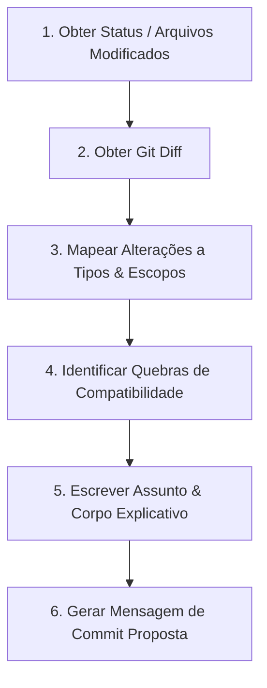

## 1. Princípios de Mensagens de Commit Semânticas

Esta skill estabelece a padronização e as regras para criação de mensagens de commit baseadas no padrão **Conventional Commits 1.0.0**. Uma boa mensagem de commit deve comunicar de forma clara o **porquê** e o **quê** da alteração, permitindo a geração automática de changelogs e facilitando a leitura do histórico do projeto.

### A. Anatomia de uma Mensagem de Commit
Toda mensagem de commit semântica deve seguir esta estrutura:

```
<tipo>(<escopo opcional>): <assunto curto no imperativo>

[corpo opcional com detalhes explicativos]

[rodapé opcional com referências a issues ou BREAKING CHANGES]
```

### B. Tipos de Commits (`type`)
Use o tipo apropriado com base na natureza da alteração:

*   **`feat`:** Introdução de uma nova funcionalidade no código (corresponde a `MINOR` no versionamento semântico).
*   **`fix`:** Correção de um bug (corresponde a `PATCH` no versionamento semântico).
*   **`docs`:** Alterações apenas na documentação (ex: README, arquivos `.md` na pasta `docs`).
*   **`style`:** Alterações que não afetam o significado do código (espaços em branco, formatação, CSS estático, ponto e vírgula ausente, etc.).
*   **`refactor`:** Alteração no código de produção que não corrige um bug nem adiciona uma funcionalidade.
*   **`perf`:** Alteração de código que melhora o desempenho.
*   **`test`:** Adição de testes ausentes ou correção de testes existentes.
*   **`build`:** Alterações que afetam o sistema de build ou dependências externas (ex: `composer.json`, `npm`).
*   **`ci`:** Alterações em arquivos de configuração e scripts de CI/CD (ex: GitHub Actions, GitLab CI).
*   **`chore`:** Outras alterações que não modificam arquivos de código de produção ou de teste (ex: `.gitignore`).

### C. Escopos Comuns do Projeto (`scope`)
O escopo identifica a seção do código afetada. No projeto `doc-engine`, os escopos recomendados são:
*   `views` (Blade templates, partials)
*   `css` (Estilos nativos)
*   `core` (Classes principais no diretório `src/`)
*   `config` (Arquivos de configuração)
*   `tests` (Arquivos de testes automatizados)
*   `ai` (Integrações com provedores de Inteligência Artificial)
*   `git` (Integrações de controle de versão ou versionamento de documentos)
*   `cli` (Comandos de console Artisan)

### D. Regras para o Assunto (Subject)
1.  Use o **imperativo** (ex: "add feature" ou "adiciona funcionalidade", nunca "added" ou "adicionou").
2.  Inicie com letra **minúscula**.
3.  **Não** termine a linha de assunto com ponto final (`.`).
4.  Limite a linha de assunto a no máximo **50-72 caracteres**.

---

## 2. Processo de Análise e Proposição de Commits

Quando acionada para criar uma mensagem de commit, a IA deve seguir este fluxo sistemático de análise:



### Passo 1: Obtenção do Status e Diff
*   Liste os arquivos modificados usando `git status`.
*   Obtenha o diff detalhado com `git diff` ou `git diff --cached` para entender o teor exato das modificações nos arquivos.

### Passo 2: Mapeamento de Tipos e Escopos
*   Se os arquivos alterados pertencem apenas a `tests/`, o tipo é obrigatoriamente `test`.
*   Se as alterações mudam layouts Blade e arquivos CSS, e tratam-se de correções ou melhorias visuais, considere `style(css)` ou `style(views)`.
*   Se há alteração de código em `src/` que altera o comportamento, avalie se é `feat` ou `fix` ou `refactor`.

### Passo 3: Detecção de BREAKING CHANGES (Quebras de Compatibilidade)
*   Verifique se as modificações removem métodos públicos, alteram a assinatura de funções do motor, mudam nomes de tabelas ou alteram substancialmente a configuração básica.
*   Nesses casos, a mensagem deve incluir um rodapé iniciando com `BREAKING CHANGE:` seguido por uma descrição clara do que foi alterado e como migrar. Isso incrementará o número da versão principal (`MAJOR`).

---

## 3. Exemplos de Mensagens

### Exemplo 1: Adição de funcionalidade (sem breaking changes)
```
feat(ai): adiciona suporte ao modelo Gemini 2.5 Flash

Integra o provedor Gemini usando a SDK do Google e configura
o DocumentationAiProvider correspondente. Atualiza o arquivo
de configuracao com os novos campos de credenciais.
```

### Exemplo 2: Correção de bug visual
```
style(css): centraliza botao de busca na barra mobile

Corrige o alinhamento de flexbox no header mobile que fazia
com que o campo de busca extrapolasse a largura da viewport
em smartphones menores.
```

### Exemplo 3: Refatoração com quebra de compatibilidade
```
refactor(core): altera retorno do DocumentRepository para Collection

Muda o tipo de retorno do metodo findAll no DocumentRepository
de array nativo para Collection do Laravel.

BREAKING CHANGE: Metodos que consomem DocumentRepository::findAll()
agora devem manipular o retorno como Collection ao inves de array.
```
