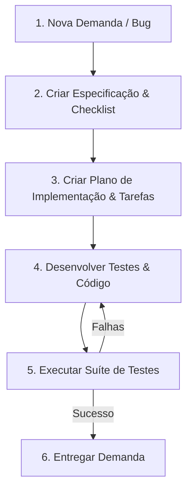

# Fluxo de Trabalho: Manutenção ou Nova Demanda

Esta skill estabelece o processo obrigatório para a realização de alterações de código no projeto, englobando desde a especificação inicial da demanda até a validação final da entrega.

---

## 1. Diretrizes Gerais

1. **Nenhuma Alteração Sem Especificação:** Qualquer correção de bug, refatoração ou nova funcionalidade deve iniciar com a criação de uma especificação clara.
2. **Git Desvinculado da Especificação:** A criação da especificação e o planejamento não devem disparar hooks ou comandos automatizados de Git (como commits ou ramificações automáticas). O controle de versão deve ser gerenciado de forma independente e consciente pelo desenvolvedor/agente.
3. **Validação por Testes:** Uma demanda só é considerada entregue quando todos os testes (novos e existentes) passarem com sucesso.

---

## 2. Passo a Passo do Processo

### Passo 1: Criação da Especificação (Baseado na Metodologia Speckit sem Git)
Você deve criar o diretório de especificação e o documento de requisitos antes de alterar o código.

1. **Identificar o Sequencial:** Identifique o próximo número sequencial de 3 dígitos disponível no diretório `specs/` (ex: `specs/001-nome-da-demanda`). Se a pasta `specs/` não existir, crie-a.
2. **Criar a Estrutura:** Crie o diretório `specs/NNN-<nome-da-demanda>/` e, dentro dele, o arquivo `spec.md`.
3. **Elaborar a Especificação (`spec.md`):** O documento deve detalhar o **quê** e o **porquê**, sem decisões de implementação de código. Inclua:
   * **Objetivo:** Descrição curta da demanda ou problema.
   * **Cenários de Uso (User Scenarios):** Fluxo de passos sob a ótica do usuário (Dado que..., Quando..., Então...).
   * **Requisitos Funcionais:** Regras que a implementação deve seguir (devem ser testáveis).
   * **Critérios de Sucesso:** Resultados mensuráveis e agnósticos de tecnologia.
   * **Garantia de Qualidade:** Checklist inicial de validação dos requisitos.

*Nota: Remova quaisquer hooks automáticos de Git (`before_specify`, `after_specify`) descritos no Spec Kit original.*

---

### Passo 2: Planejamento da Implementação
No mesmo diretório da especificação (`specs/NNN-<nome-da-demanda>/`), crie os seguintes arquivos de controle:

1. **`plan.md`:** 
   * Liste os arquivos que serão criados ou editados.
   * Defina a estratégia técnica e arquitetura a ser adotada (conforme a skill de `arquitetura` e `design-pattern`).
2. **`tasks.md`:**
   * Crie uma lista ordenada de tarefas a serem realizadas com caixas de seleção (`- [ ]`).
   * **Obrigatório:** Incluir tarefas de criação/atualização de testes e uma tarefa final de execução geral dos testes.

---

### Passo 3: Implementação Orientada a Testes (TDD/Test-First)
Antes de modificar a lógica de negócios da aplicação:

1. **Escrever os Testes:** Crie ou atualize os arquivos correspondentes na pasta `tests/` (como `tests/Feature/` ou `tests/Unit/`). Os testes devem validar diretamente os cenários descritos em `spec.md`.
2. **Codificar:** Implemente as alterações de código necessárias no projeto.
3. **Marcar Progresso:** Vá marcando as tarefas como concluídas (`- [X]`) em `tasks.md`.

---

### Passo 4: Execução e Sucesso dos Testes
> [!IMPORTANT]
> **A demanda só está entregue se 100% dos testes passarem com sucesso.**
> Não presuma que a implementação está concluída sem a execução da suíte de testes automatizados do projeto.

1. Rode os testes automatizados do projeto (ex: `vendor/bin/phpunit` ou `php artisan test`).
2. Se houver falhas, corrija o código de produção ou o teste e execute-os novamente.
3. Obtenha 100% de sucesso nos testes relacionados e garanta que nenhuma regressão foi introduzida nos testes existentes.

---

### Passo 5: Registro e Entrega
Após todos os testes passarem com sucesso:
1. Crie um relatório final de entrega (você pode utilizar a skill `create-task-report` se disponível).
2. O relatório deve conter o log de sucesso dos testes e o resumo dos arquivos modificados.
