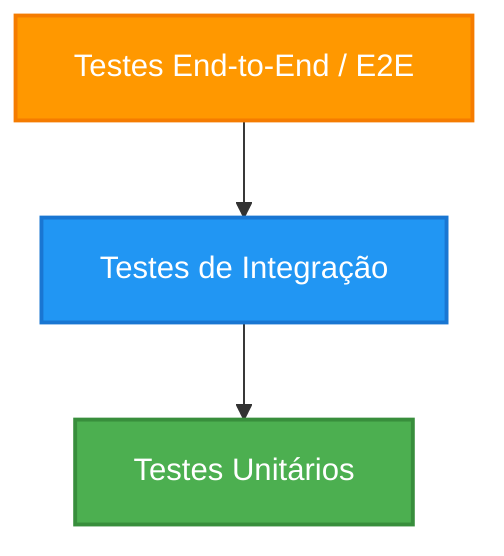

## 1. Skill Overview and Principles

Esta skill estabelece as diretrizes para a criação de uma suíte de testes robusta, rápida e confiável. Testes automatizados não servem apenas para evitar bugs; eles servem como documentação viva do comportamento do sistema e viabilizam refatorações seguras.

### 1.1 A Pirâmide de Testes

A organização dos testes deve seguir a **Pirâmide de Testes**, priorizando testes rápidos e baratos na base e testes mais lentos e integrados no topo:



1. **Testes Unitários (Base - Maior volume):**
   * **Objetivo:** Validar a menor unidade testável de código (funções, métodos, classes de domínio) de forma isolada.
   * **Características:** Extremamente rápidos (milissegundos), sem acesso a redes, bancos de dados ou sistema de arquivos.
   * **Princípio:** Alta granularidade e feedback instantâneo.

2. **Testes de Integração (Meio - Volume moderado):**
   * **Objetivo:** Validar a interação entre duas ou mais unidades do sistema, ou entre o sistema e dependências externas (bancos de dados, APIs, filas).
   * **Características:** Mais lentos que testes unitários. Podem usar bancos de dados reais (ou em memória/Docker) e recursos de rede controlados.
   * **Princípio:** Garantir que o contrato e a comunicação entre partes distintas funcionam conforme esperado.

3. **Testes End-to-End / E2E (Topo - Menor volume):**
   * **Objetivo:** Simular a jornada completa do usuário final, do frontend ao banco de dados e APIs externas.
   * **Características:** Lentos, frágeis a mudanças de interface (flaky tests) e caros para manter.
   * **Princípio:** Validar fluxos críticos de negócio no ambiente mais próximo possível de produção.

---

### 1.2 Princípios de Testes Limpos

#### Padrão Arrange-Act-Assert (AAA)
Toda estrutura de teste deve ser legível e dividida visualmente em três blocos distintos:
* **Arrange (Preparar):** Configuração do cenário do teste (criação de variáveis, preparação de mocks, inserção de dados iniciais).
* **Act (Agir):** Execução da ação ou invocação do método sob teste.
* **Assert (Verificar):** Validação dos resultados obtidos contra as expectativas declaradas.

#### O Acrônimo F.I.R.S.T.
* **Fast (Rápido):** A suite de testes deve rodar rapidamente para não desencorajar a execução constante.
* **Independent (Independente):** Um teste não deve depender do estado gerado por outro teste. O banco de dados ou estado em memória deve ser limpo/redefinido antes de cada teste.
* **Repeatable (Repetível):** O teste deve apresentar o mesmo resultado em qualquer ambiente (máquina local, CI/CD, container), sem depender de fatores externos instáveis (ex: data/hora atual sem mock).
* **Self-Validating (Auto-validável):** O teste deve ter um resultado binário claro: ou passou (pass) ou falhou (fail). Não deve requerer interpretação manual de logs.
* **Timely (Oportuno):** Os testes devem ser escritos no momento adequado (junto ao código ou preferencialmente antes, no caso de TDD).

---

### 1.3 Test Doubles (Dublês de Teste)

Para garantir o isolamento dos testes, substituímos dependências reais por Dublês de Teste. Eles se dividem em:

| Tipo | Propósito | Exemplo de Uso |
| :--- | :--- | :--- |
| **Dummy** | Objeto passado apenas para preencher parâmetros obrigatórios, cujo comportamento não é utilizado no teste. | Um objeto `User` vazio passado para um construtor que só precisa de um ID. |
| **Stub** | Fornece respostas prontas e predefinidas para chamadas feitas durante o teste. Não responde a nada fora do planejado. | Mockar uma chamada HTTP para retornar um JSON estático `{"status": 200}`. |
| **Spy** | Um Stub que também registra informações sobre como foi chamado (parâmetros recebidos, número de chamadas). | Verificar se um método `sendEmail` foi chamado exatamente uma vez com o email correto. |
| **Mock** | Objeto pré-programado com expectativas que formam uma especificação da chamada que se espera receber. | Definir que o objeto *deve* receber a chamada X com os parâmetros Y, sob risco de falhar o teste se isso não ocorrer. |
| **Fake** | Implementação funcional simplificada da dependência, inadequada para produção mas útil para testes rápidos. | Um banco de dados em memória (`sqlite::memory:`) substituindo o banco PostgreSQL de produção. |

---

### 1.4 Cobertura de Testes e Regressão

* **Cobertura de Código (Code Coverage):** Mede quais linhas, branches e caminhos foram executados pela suíte de testes.
  * *Atenção:* Cobertura alta (ex: 90%) não garante qualidade nem ausência de bugs. É fácil cobrir linhas sem validar os fluxos lógicos alternativos ou valores limite (edge cases). Priorize cobrir caminhos críticos de negócio.
* **Testes de Regressão:** Garantia contínua de que novas implementações ou refatorações não quebraram comportamentos antigos. Toda correção de bug deve ser acompanhada de um caso de teste que reproduzia o bug (evitando que ele volte a ocorrer).

---

## 2. Templates / Implementation Patterns

Abaixo estão os templates estruturais de arquivos de teste para os frameworks mais populares em JS/TS, Python e PHP, aplicando as boas práticas descritas.

### 2.1 JavaScript / TypeScript (Jest ou Vitest)

```typescript
// src/services/UserService.test.ts
import { UserService } from './UserService';
import { UserRepository } from '../repositories/UserRepository';
import { EmailService } from './EmailService';

describe('UserService', () => {
  let userService: UserService;
  
  // Mocks/Spies tipados
  let mockUserRepository: jest.Mocked<UserRepository>;
  let mockEmailService: jest.Mocked<EmailService>;

  beforeEach(() => {
    // Limpeza e reconfiguração do cenário inicial antes de cada teste
    jest.clearAllMocks();

    mockUserRepository = {
      save: jest.fn(),
      findByEmail: jest.fn(),
    } as unknown as jest.Mocked<UserRepository>;

    mockEmailService = {
      sendWelcomeEmail: jest.fn(),
    } as unknown as jest.Mocked<EmailService>;

    userService = new UserService(mockUserRepository, mockEmailService);
  });

  describe('register', () => {
    it('deve registrar um novo usuário com sucesso e enviar email de boas-vindas', async () => {
      // 1. Arrange (Preparar)
      const userData = { name: 'John Doe', email: 'john@example.com' };
      const createdUser = { id: 'uuid-123', ...userData };
      
      mockUserRepository.findByEmail.mockResolvedValue(null); // Usuário não existe
      mockUserRepository.save.mockResolvedValue(createdUser);

      // 2. Act (Agir)
      const result = await userService.register(userData);

      // 3. Assert (Verificar)
      expect(result).toEqual(createdUser);
      expect(mockUserRepository.findByEmail).toHaveBeenCalledWith('john@example.com');
      expect(mockUserRepository.save).toHaveBeenCalledWith(userData);
      expect(mockEmailService.sendWelcomeEmail).toHaveBeenCalledTimes(1);
      expect(mockEmailService.sendWelcomeEmail).toHaveBeenCalledWith(createdUser);
    });

    it('deve lançar um erro se o email já estiver cadastrado', async () => {
      // 1. Arrange (Preparar)
      const userData = { name: 'John Doe', email: 'john@example.com' };
      mockUserRepository.findByEmail.mockResolvedValue({ id: 'existing-id', ...userData });

      // 2. Act & Assert (Agir e Verificar juntos para captura de erros)
      await expect(userService.register(userData))
        .rejects
        .toThrow('Email já cadastrado');
      
      expect(mockUserRepository.save).not.toHaveBeenCalled();
      expect(mockEmailService.sendWelcomeEmail).not.toHaveBeenCalled();
    });
  });
});
```

### 2.2 Python (Pytest)

```python
# tests/services/test_user_service.py
import pytest
from unittest.mock import Mock, AsyncMock
from app.services.user_service import UserService
from app.exceptions import EmailAlreadyExistsException

# Fixtures do Pytest organizam a preparação (Arrange)
@pytest.fixture
def mock_user_repository():
    repo = Mock()
    repo.find_by_email = AsyncMock()
    repo.save = AsyncMock()
    return repo

@pytest.fixture
def mock_email_service():
    service = Mock()
    service.send_welcome_email = AsyncMock()
    return service

@pytest.fixture
def user_service(mock_user_repository, mock_email_service):
    return UserService(
        user_repository=mock_user_repository,
        email_service=mock_email_service
    )

@pytest.mark.asyncio
async def test_register_user_successfully(user_service, mock_user_repository, mock_email_service):
    # Arrange
    user_data = {"name": "John Doe", "email": "john@example.com"}
    created_user = {"id": "uuid-123", **user_data}
    
    mock_user_repository.find_by_email.return_value = None
    mock_user_repository.save.return_value = created_user

    # Act
    result = await user_service.register(user_data)

    # Assert
    assert result == created_user
    mock_user_repository.find_by_email.assert_called_once_with("john@example.com")
    mock_user_repository.save.assert_called_once_with(user_data)
    mock_email_service.send_welcome_email.assert_called_once_with(created_user)

@pytest.mark.asyncio
async def test_register_user_raises_error_if_email_exists(user_service, mock_user_repository, mock_email_service):
    # Arrange
    user_data = {"name": "John Doe", "email": "john@example.com"}
    mock_user_repository.find_by_email.return_value = {"id": "existing-id", **user_data}

    # Act & Assert
    with pytest.raises(EmailAlreadyExistsException) as exc_info:
        await user_service.register(user_data)
        
    assert str(exc_info.value) == "Email já cadastrado"
    mock_user_repository.save.assert_not_called()
    mock_email_service.send_welcome_email.assert_not_called()
```

### 2.3 PHP (PHPUnit)

```php
<?php
// tests/Unit/Services/UserServiceTest.php

namespace Tests\Unit\Services;

use PHPUnit\Framework\TestCase;
use App\Services\UserService;
use App\Repositories\UserRepository;
use App\Services\EmailService;
use App\Exceptions\EmailAlreadyExistsException;

class UserServiceTest extends TestCase
{
    private $userRepositoryMock;
    private $emailServiceMock;
    private $userService;

    protected function setUp(): void
    {
        parent::setUp();

        // Arrange comum (Preparação de dublês de teste)
        $this->userRepositoryMock = $this->createMock(UserRepository::class);
        $this->emailServiceMock = $this->createMock(EmailService::class);

        $this->userService = new UserService(
            $this->userRepositoryMock,
            $this->emailServiceMock
        );
    }

    public function testRegisterUserSuccessfully(): void
    {
        // Arrange
        $userData = ['name' => 'John Doe', 'email' => 'john@example.com'];
        $createdUser = array_merge(['id' => 'uuid-123'], $userData);

        $this->userRepositoryMock->expects($this->once())
            ->method('findByEmail')
            ->with('john@example.com')
            ->willReturn(null);

        $this->userRepositoryMock->expects($this->once())
            ->method('save')
            ->with($userData)
            ->willReturn($createdUser);

        $this->emailServiceMock->expects($this->once())
            ->method('sendWelcomeEmail')
            ->with($createdUser);

        // Act
        $result = $this->userService->register($userData);

        // Assert
        $this->assertEquals($createdUser, $result);
    }

    public function testRegisterUserThrowsExceptionIfEmailAlreadyExists(): void
    {
        // Arrange
        $userData = ['name' => 'John Doe', 'email' => 'john@example.com'];
        $existingUser = array_merge(['id' => 'existing-id'], $userData);

        $this->userRepositoryMock->expects($this->once())
            ->method('findByEmail')
            ->with('john@example.com')
            ->willReturn($existingUser);

        // O save e sendWelcomeEmail NUNCA devem ser chamados
        $this->userRepositoryMock->expects($this->never())->method('save');
        $this->emailServiceMock->expects($this->never())->method('sendWelcomeEmail');

        // Assert da exceção antes da execução (Act)
        $this->expectException(EmailAlreadyExistsException::class);
        $this->expectExceptionMessage('Email já cadastrado');

        // Act
        $this->userService->register($userData);
    }
}
```

---

## 3. Step-by-Step Instructions

Sempre que a skill **tests** for invocada para criar, melhorar ou refatorar testes, execute os seguintes passos:

### Passo 1: Analisar o Código e Ambiente Atual
1. **Identificar o escopo sob teste:** Qual classe, função ou fluxo de negócio precisa de testes?
2. **Entender a arquitetura da aplicação:** Onde ficam localizados os arquivos de teste na estrutura atual? (ex: pasta `tests/`, arquivos `.spec.ts` ao lado do código fonte, etc.).
3. **Identificar o framework e runners ativos:**
   * Olhar `package.json` para Jest/Vitest/Cypress/Playwright.
   * Olhar `requirements.txt` ou `pyproject.toml` para Pytest.
   * Olhar `composer.json` para PHPUnit/Pest.
4. **Verificar os comandos de teste existentes:** Localize como os testes são executados (ex: `npm run test`, `pytest`, `vendor/bin/phpunit`).

### Passo 2: Alinhamento com o Usuário
Antes de sair escrevendo os testes, confirme os seguintes pontos com o usuário (se não estiverem claros no contexto):
1. *"Qual é o framework de testes e a biblioteca de mocks/asserções padrão do projeto?"*
2. *"Estamos escrevendo testes Unitários, de Integração ou End-to-End para esta funcionalidade?"*
3. *"Para os testes de Integração/E2E, há algum banco de dados configurado para testes ou devemos criar mocks/fakes para a camada de persistência?"*
4. *"Qual é a convenção de nomenclatura dos arquivos de teste e das suítes no projeto?"*

### Passo 3: Implementação dos Testes (Respeitando a Pirâmide e Boas Práticas)
1. **Criar o arquivo de testes** no local adequado e com a nomenclatura correta (ex: `UserService.spec.ts`).
2. **Construir o esqueleto do teste:** Use blocos `describe`/`it`/`test` que representem cenários claros de negócio, e não apenas o nome técnico do método.
   * *Nomenclatura recomendada:* `deve [comportamento esperado] quando [cenário/contexto]` ou `should [expected behavior] when [scenario]`.
3. **Implementar os testes usando a estrutura Arrange-Act-Assert (AAA):**
   * Separe os três blocos visualmente por uma linha em branco.
   * Configure os mocks no *Arrange*. Evite sobrecarregar o *beforeEach* com mocks específicos de apenas um caso de teste para manter a legibilidade individual de cada teste.
   * Invoque o comportamento sob teste no *Act*.
   * Faça asserções explícitas e limpas no *Assert*.
4. **Garantir o isolamento:** Limpe os mocks e dados temporários após cada teste usando os hooks adequados (`afterEach`, `beforeEach`).

### Passo 4: Execução, Validação e Avaliação
1. **Executar a suite de testes:** Proponha ou execute o comando para rodar os testes específicos recém-criados.
2. **Verificar a cobertura de testes:** Se configurado, execute com a flag de cobertura (ex: `--coverage`) para garantir que os caminhos principais e ramificações condicionais (if/else) foram alcançados.
3. **Tratar falhas / Flaky Tests:** Se algum teste falhar de forma intermitente ou por conta de fuso horário/dependência externa, refatore-o para usar stubs/spies adequados.
4. **Apresentar o resultado:** Mostre os arquivos criados e dê instruções de como o usuário pode executá-los em sua máquina local.
