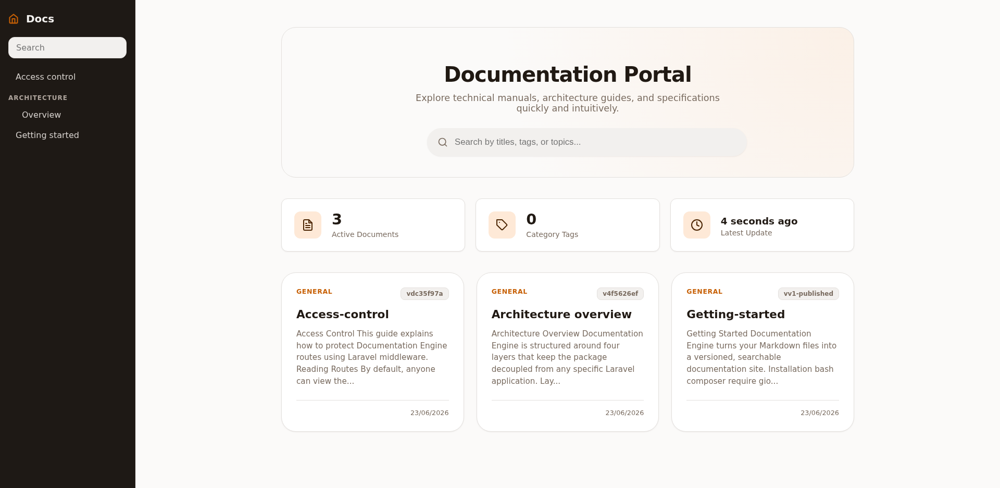
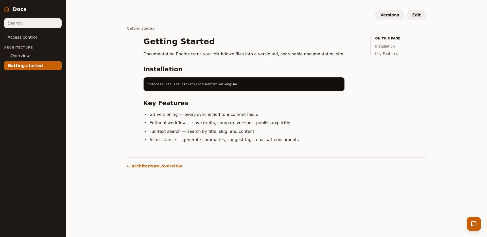
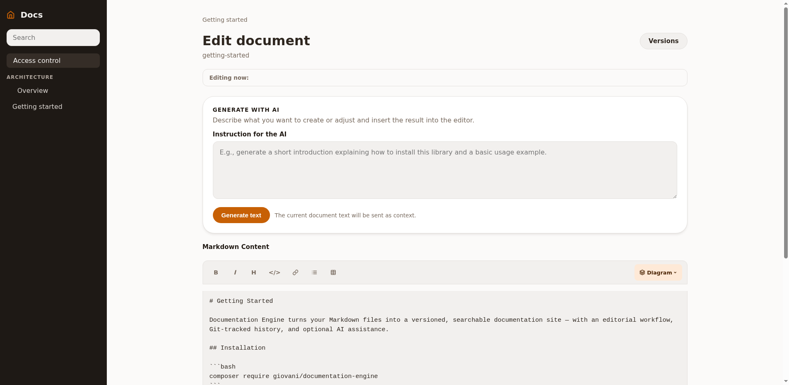
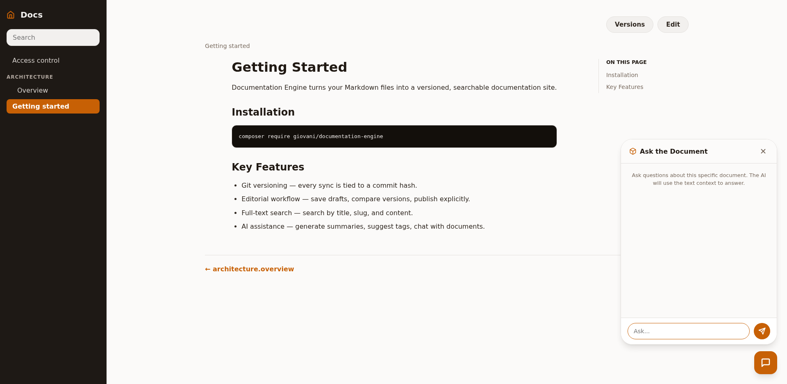
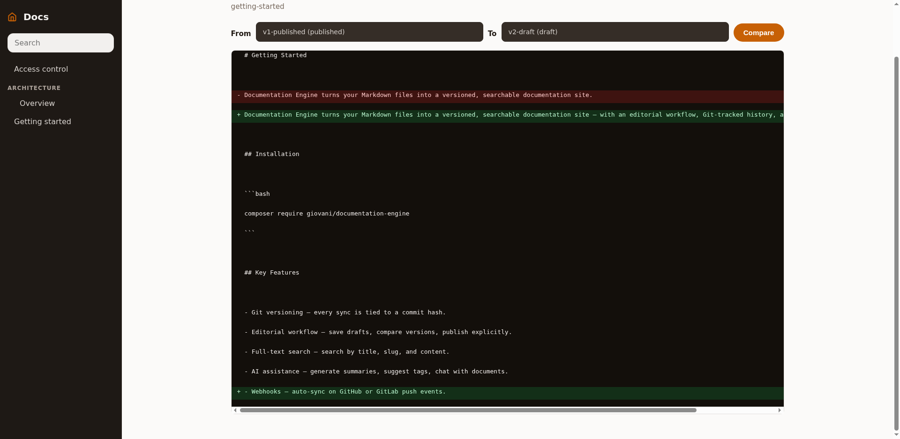

<div align="center">

# Documentation Engine

**A Markdown documentation engine for Laravel with Git versioning and AI integration.**

[](https://github.com/giovani/documentation-engine/actions/workflows/tests.yml)
[](https://packagist.org/packages/giovani/documentation-engine)
[](https://packagist.org/packages/giovani/documentation-engine)
[](https://laravel.com)
[](LICENSE.md)

```bash
composer require giovani/documentation-engine
```

</div>

---

## Screenshots

**Document catalog** — searchable index with document cards, stats, and sidebar navigation.



**Reading view** — rendered Markdown with table of contents, breadcrumb, and prev/next navigation.



**Editor with AI generation** — browser-based Markdown editor with AI content generation and Mermaid diagram support.



**AI chat** — ask questions about any document; the AI uses its content as context.



**Version diff** — compare any two versions side by side with line-level diff highlighting.



---

Documentation Engine turns your `docs/` Markdown files into a versioned, searchable documentation site — with an editorial workflow, Git-tracked history, and optional AI assistance — all running inside your existing Laravel application.

## Why Documentation Engine?

Most teams already write documentation as Markdown files. Documentation Engine makes those files a first-class feature of your app: sync them from the filesystem into the database, browse and edit them through a responsive UI, and let AI help keep them accurate and well-organized.

- **Zero extra infrastructure.** Runs on your existing Laravel app and database.
- **Git as the source of truth.** Document versions are tied to commit hashes.
- **No lock-in.** Your docs remain plain Markdown files on disk.
- **Optional AI.** OpenAI and Gemini are supported, but never required.

## Features

| | |
|---|---|
| **Git-Driven Sync** | `php artisan docs:sync` reads your Markdown files, detects changes via Git diff, and creates new database versions only when content changes. Idempotent and safe to run repeatedly. |
| **Document Versioning** | Every change creates a `draft` version. A previous `published` version keeps serving readers until you explicitly promote the draft. Full version history with diff comparison. |
| **Editorial Workflow** | Browser-based editor with save-as-draft and explicit publish. Protect editing routes with any Laravel middleware (e.g. `auth`). |
| **AI Integration** | Generate TL;DRs, suggest tags, improve writing, or chat with a document. Supports OpenAI and Google Gemini — switchable per request. |
| **Full-Text Search** | Built-in local search across titles, slugs, and published content. No Elasticsearch required. |
| **Webhooks** | GitHub and GitLab webhooks trigger automatic sync with HMAC signature validation. |
| **Smart Caching** | Rendered HTML, sidebars, and navigation are cached per slug and invalidated on publish. Redis-ready. |
| **Fully Customizable** | Publish views, CSS, config, and migrations. Point to your own Blade layout via a single env variable. |
| **Internationalizable** | Translation files publishable via `documentation-translations` tag. |
| **UML Diagrams** | Mermaid diagram rendering built into the editor toolbar. |

## Requirements

- PHP 8.2+
- Laravel 10, 11, or 12
- A configured database (MySQL, PostgreSQL, or SQLite)
- Git available on the host (optional, required for commit-hash tracking)

## Installation

**1. Install via Composer:**

```bash
composer require giovani/documentation-engine
```

**2. Set up environment variables:**

```bash
vendor/bin/documentation-engine-env
```

This interactive script appends only missing keys to your `.env`, preserving all existing values.

**3. Publish and migrate:**

```bash
php artisan vendor:publish --tag="documentation-config"
php artisan vendor:publish --tag="documentation-assets"
php artisan migrate
```

**4. Sync your docs:**

```bash
php artisan docs:sync
```

**5. Visit `/docs` in your browser.**

## Sync Command

```bash
# Sync all docs from the configured path
php artisan docs:sync

# Sync into a named project namespace
php artisan docs:sync my-project

# Sync from a custom path
php artisan docs:sync --path=/absolute/path/to/docs

# Preview changes without writing anything
php artisan docs:sync --dry-run
```

During sync, the engine:
- Runs `git pull` and reads the current commit hash
- Detects changed files via Git diff
- Creates a new `document_versions` record only when the content checksum changes
- Marks files removed from the filesystem as `archived`
- Invalidates the render cache for changed slugs
- Reports a summary: files read, changed, ignored, archived, errored

## Routes

The package registers these routes automatically:

```
GET  /docs                                  → index / redirect to home doc
GET  /docs/search?q=term                    → full-text search
GET  /docs/{slug}                           → read a document
GET  /docs/{slug}/edit                      → browser editor
PUT  /docs/{slug}                           → save draft
GET  /docs/{slug}/versions                  → version history
GET  /docs/{slug}/versions/compare?from=&to= → side-by-side diff
POST /docs/{slug}/versions/{id}/publish     → publish a version
POST /docs/{slug}/generate                  → AI content generation
POST /docs/{slug}/chat                      → AI chat
POST /docs/webhooks/github                  → GitHub webhook
POST /docs/webhooks/gitlab                  → GitLab webhook
```

## Editorial Workflow

The UI saves changes as `draft` versions. Readers keep seeing the current `published` version until you click **Publish**.

```
draft → published → archived (when superseded)
```

Protect editing routes with middleware:

```dotenv
DOC_ENGINE_EDIT_MIDDLEWARE=auth
DOC_ENGINE_EDIT_MIDDLEWARE=web,auth,role:editor
```

## AI Features

Enable AI and choose a provider:

```dotenv
DOC_ENGINE_AI_ENABLED=true
DOCUMENTATION_AI_PROVIDER=openai   # or gemini
OPENAI_API_KEY=sk-...
```

Available operations via `POST /docs/{slug}/generate`:

```json
{ "type": "tldr" }
{ "type": "suggest_tags" }
{ "prompt": "Rewrite this as a step-by-step guide" }
{ "provider": "gemini", "model": "gemini-2.5-flash", "prompt": "Improve clarity" }
```

Chat with a document via `POST /docs/{slug}/chat`:

```json
{ "message": "What are the main points of this document?" }
```

## Webhooks

**GitHub:**

```dotenv
DOC_ENGINE_WEBHOOK_SECRET=your-secret
DOC_ENGINE_WEBHOOK_BRANCH=main
```

Point your GitHub webhook to `POST /docs/webhooks/github`. The package validates the `X-Hub-Signature-256` HMAC when a secret is configured.

**GitLab:**

Point your GitLab webhook to `POST /docs/webhooks/gitlab`. The `X-Gitlab-Token` header is validated against `DOC_ENGINE_WEBHOOK_SECRET`.

## Configuration

All configuration is available in `config/documentation-engine.php` after publishing. The key variables:

```dotenv
# Path to your Markdown files (relative to Laravel base path)
DOC_ENGINE_PATH=docs

# Blade layout for the documentation UI
DOC_ENGINE_LAYOUT=documentation-engine::layouts.default

# Custom CSS file
DOC_ENGINE_CSS=

# Middleware for reading routes
DOC_ENGINE_MIDDLEWARE=web

# Middleware for editing routes
DOC_ENGINE_EDIT_MIDDLEWARE=

# Webhook secret for GitHub / GitLab
DOC_ENGINE_WEBHOOK_SECRET=

# Branch that triggers webhook sync
DOC_ENGINE_WEBHOOK_BRANCH=main

# AI
DOC_ENGINE_AI_ENABLED=false
DOCUMENTATION_AI_PROVIDER=openai
OPENAI_API_KEY=
GEMINI_API_KEY=
```

## Publish Tags

| Tag | What it publishes |
|---|---|
| `documentation-config` | `config/documentation-engine.php` |
| `documentation-views` | Blade templates to `resources/views/documentation-engine/` |
| `documentation-assets` | CSS files to `resources/css/documentation-engine/docs/` |
| `documentation-migrations` | Database migrations |
| `documentation-translations` | Language files |

## Caching

Rendered HTML is cached per slug (`doc_render_{slug}`). Navigation structures are cached per project (`doc_slugs_{key}`, `doc_sidebar_{key}`). All caches are invalidated automatically on sync, publish, edit, or archive.

For production, configure Redis as the cache driver for best results.

## Quality

```bash
composer test      # PHPUnit test suite
composer analyse   # PHPStan static analysis (level 5)
composer format    # Laravel Pint code formatting
```

## Troubleshooting

**`/docs` returns 404 or "No documentation found":**
Make sure Markdown files exist under `DOC_ENGINE_PATH` and run `php artisan docs:sync`.

**AI routes return 404:**
Check that `DOC_ENGINE_AI_ENABLED=true` is set.

**Custom views not loading:**
```bash
php artisan config:clear
php artisan view:clear
```

## Changelog

See [CHANGELOG.md](CHANGELOG.md) for the full history.

## License

The MIT License (MIT). See [LICENSE.md](LICENSE.md).
