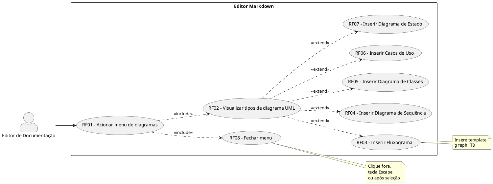
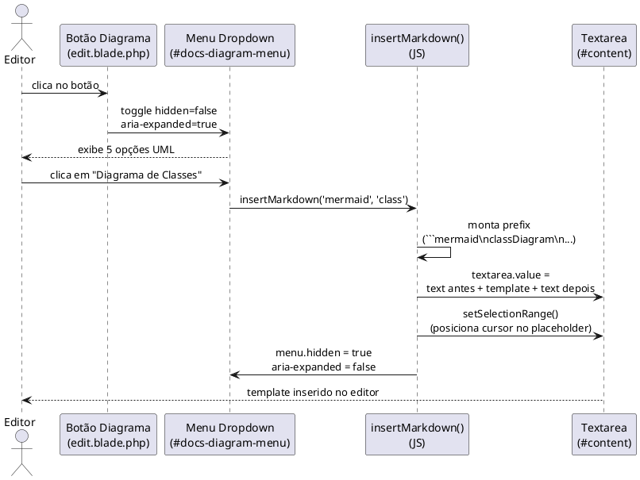
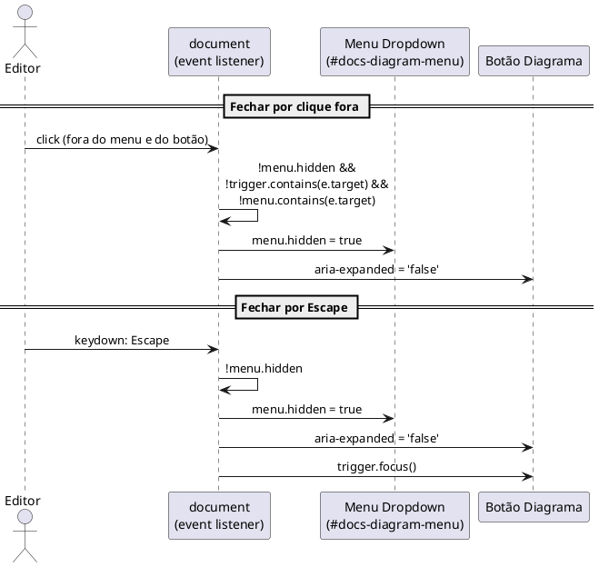
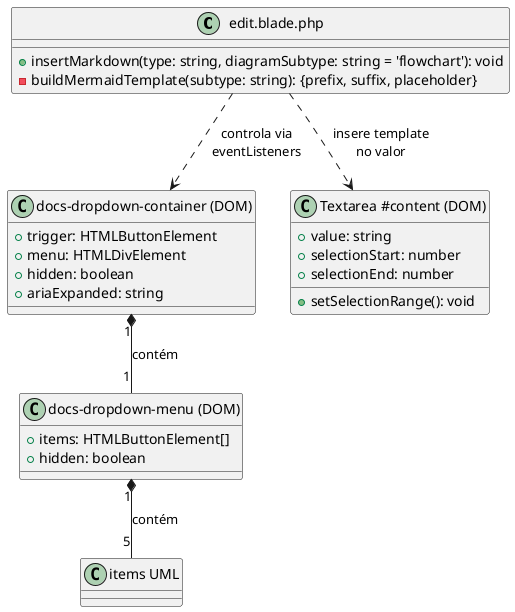

# Documento de Requisitos e Análise
# Demanda 006 — Criação de Diagramas UML no Editor

## 1. Visão Geral

Expansão do botão "Diagrama" na barra de ferramentas do editor de documentação (`/docs/:slug/edit`). O comportamento de clique simples é substituído por um menu dropdown M3 com cinco tipos de diagramas UML em sintaxe Mermaid.js: Fluxograma, Sequência, Classes, Casos de Uso e Estado. Ao selecionar um tipo, o template correspondente é inserido na posição do cursor na `<textarea>` do editor e o dropdown é fechado automaticamente.

---

## 2. Regras de Negócio (RN)

| ID | Nome | Descrição |
| :--- | :--- | :--- |
| RN01 | Template por subtipo | Cada tipo de diagrama possui um template Mermaid pré-definido e imutável pelo sistema. O conteúdo inserido é sempre o template padrão, nunca vazio. |
| RN02 | Inserção na posição do cursor | O template é inserido na posição atual do cursor na `<textarea>`. Se houver texto selecionado, ele é substituído pelo template. |
| RN03 | Retrocompatibilidade da função | A função `insertMarkdown(type, diagramSubtype)` deve manter o comportamento anterior ao receber chamadas sem o segundo argumento, usando `'flowchart'` como valor padrão. |
| RN04 | Fechamento do dropdown | O dropdown fecha após qualquer seleção de tipo de diagrama, ao clicar fora da área do menu, ou ao pressionar `Escape`. |
| RN05 | Internacionalização obrigatória | Todos os labels visíveis ao usuário no dropdown devem usar chaves do sistema de i18n (`__('documentation-engine::messages.*')`), nunca strings literais. |
| RN06 | Acessibilidade ARIA | O botão acionador deve refletir o estado do menu via `aria-expanded` (`true`/`false`). O menu deve ter `role="menu"` implícito via estrutura semântica. |

---

## 3. Requisitos Funcionais (RF)

| ID | Nome | Descrição | Prioridade |
| :--- | :--- | :--- | :--- |
| RF01 | Botão acionador com dropdown | Substituir o clique direto do botão "Diagrama" por um acionador de dropdown com ícone de seta indicativa (`▾`). | Alta |
| RF02 | Menu com 5 tipos de diagrama | Exibir menu flutuante com: Fluxograma, Diagrama de Sequência, Diagrama de Classes, Diagrama de Casos de Uso e Diagrama de Estado. | Alta |
| RF03 | Inserção de template Fluxograma | Ao selecionar "Fluxograma", inserir bloco `graph TD` com nós de processo e decisão. | Alta |
| RF04 | Inserção de template Sequência | Ao selecionar "Diagrama de Sequência", inserir bloco `sequenceDiagram` com participantes e setas. | Alta |
| RF05 | Inserção de template Classes | Ao selecionar "Diagrama de Classes", inserir bloco `classDiagram` com classe exemplo e atributo/método. | Alta |
| RF06 | Inserção de template Casos de Uso | Ao selecionar "Casos de Uso", inserir bloco `usecaseDiagram` com actor e usecase. | Alta |
| RF07 | Inserção de template Estado | Ao selecionar "Diagrama de Estado", inserir bloco `stateDiagram-v2` com transições. | Alta |
| RF08 | Controle JS de abertura/fechamento | Implementar toggle ao clicar no botão acionador, fechar ao clicar fora (document click) e ao pressionar `Escape`. | Alta |
| RF09 | Estilos CSS M3 do dropdown | Adicionar em `components.css`: `.docs-dropdown-container`, `.docs-dropdown-menu`, `.docs-dropdown-item` com posicionamento absoluto, animação scale+fade e hover/focus. | Média |
| RF10 | Chaves de i18n para tipos de diagrama | Adicionar chaves `flowchart`, `sequence_diagram`, `class_diagram`, `usecase_diagram`, `state_diagram` nos arquivos `pt/messages.php` e `en/messages.php`. | Média |
| RF11 | Testes automatizados de regressão | Adicionar asserções em `FormattingToolsTest` verificando a presença do container dropdown e das chamadas de inserção de cada subtipo no HTML da página de edição. | Alta |

---

## 4. Requisitos Não Funcionais (RNF)

| ID | Nome | Descrição | Categoria |
| :--- | :--- | :--- | :--- |
| RNF01 | Sem dependências externas | O dropdown deve ser implementado com CSS e JS vanilla — sem bibliotecas adicionais. | Manutenibilidade |
| RNF02 | Animação de 200ms | A abertura do menu deve ter duração máxima de 200ms (`scale(0.95→1) + opacity(0→1)`) para não atrasar a interação. | Performance |
| RNF03 | Área de clique mínima 40px | Altura mínima de 40px por item do dropdown para conformidade WCAG 2.1 AA (target size). | Acessibilidade |
| RNF04 | Teclado navegável | O menu deve ser navegável via `Tab` e `Escape` sem dependência de mouse. | Acessibilidade |
| RNF05 | Suíte de testes 100% verde | Nenhum teste existente deve ser quebrado pela alteração. O CI deve passar integralmente. | Confiabilidade |
| RNF06 | Consistência visual M3 | O dropdown deve usar exclusivamente as CSS custom properties `--docs-*` já definidas no projeto, sem hardcode de cores ou medidas. | Manutenibilidade |

---

## 5. Diagramas UML (PlantUML)

### 5.1 Diagrama de Caso de Uso

### 5.2 Diagrama de Sequência — Seleção de Tipo de Diagrama (cenário principal)

### 5.3 Diagrama de Sequência — Fechamento por clique externo e Escape

### 5.4 Diagrama de Classes — Estrutura do módulo JS no editor

---

## 6. Mapeamento para Plane (Cards)

| Título do Card | Descrição (HTML Format) | Prioridade |
| :--- | :--- | :--- |
| [006] Testes: dropdown UML no editor | `<h3>Tarefas</h3><ul><li>Adicionar teste <code>edit_page_contains_uml_diagrams_dropdown_options</code> em <code>FormattingToolsTest.php</code></li><li>Assertar presença de <code>docs-dropdown-container</code> no HTML</li><li>Assertar chamadas <code>insertMarkdown('mermaid', 'sequence')</code>, <code>'class'</code>, <code>'usecase'</code>, <code>'state'</code></li><li>Executar suíte PHPUnit e garantir 100% verde</li></ul>` | high |
| [006] i18n: chaves dos tipos de diagrama | `<h3>Tarefas</h3><ul><li>Adicionar chaves <code>flowchart</code>, <code>sequence_diagram</code>, <code>class_diagram</code>, <code>usecase_diagram</code>, <code>state_diagram</code> em <code>resources/lang/pt/messages.php</code></li><li>Adicionar as mesmas chaves com tradução em inglês em <code>resources/lang/en/messages.php</code></li></ul>` | medium |
| [006] CSS: estilos do dropdown M3 | `<h3>Tarefas</h3><ul><li>Adicionar <code>.docs-dropdown-container</code> com <code>position: relative</code> em <code>components.css</code></li><li>Adicionar <code>.docs-dropdown-menu</code> com posicionamento absoluto, <code>border-radius</code>, <code>box-shadow</code> e animação <code>scale+fade</code> 200ms</li><li>Adicionar <code>.docs-dropdown-item</code> com hover/focus usando <code>--docs-surface-muted</code> e <code>--docs-accent</code></li><li>Adicionar keyframe <code>docsDropdownFadeIn</code></li></ul>` | medium |
| [006] View: dropdown UML e função insertMarkdown | `<h3>Tarefas</h3><ul><li>Substituir botão simples por estrutura <code>.docs-dropdown-container</code> com trigger e menu em <code>edit.blade.php</code></li><li>Adicionar 5 itens no menu: Fluxograma, Sequência, Classes, Casos de Uso, Estado</li><li>Atualizar assinatura de <code>insertMarkdown(type, diagramSubtype = 'flowchart')</code></li><li>Implementar templates Mermaid para cada subtipo no switch da função</li><li>Implementar JS: toggle ao clicar no trigger, fechar ao clicar fora, fechar com Escape</li><li>Usar chaves i18n (<code>__('documentation-engine::messages.*')</code>) em todos os labels</li></ul>` | high |
| [006] Sync: atualizar arquivos de teste Laravel | `<h3>Tarefas</h3><ul><li>Sincronizar <code>resources/views/edit.blade.php</code> editado para <code>tests/laravel/resources/views/</code></li><li>Sincronizar <code>resources/css/docs/components.css</code> para <code>tests/laravel/</code></li><li>Sincronizar arquivos de lang PT e EN para <code>tests/laravel/</code></li><li>Executar <code>vendor/bin/phpunit</code> para validação final</li></ul>` | high |
